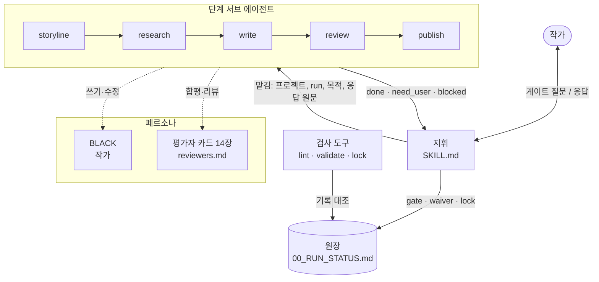
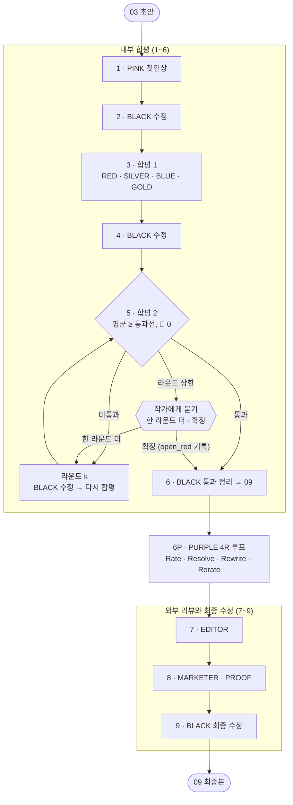
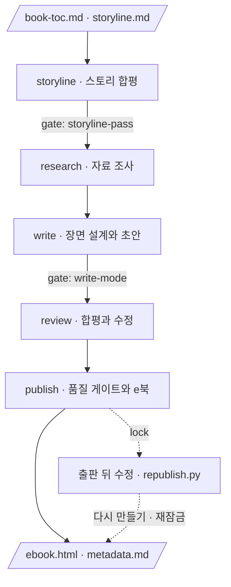
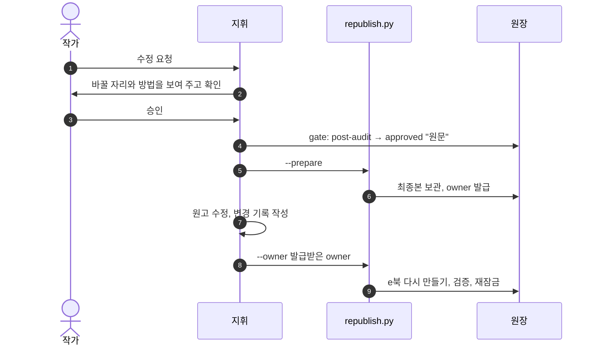

# novel-writing

**AI 에이전트 팀이 한 편의 소설을 설계하고, 쓰고, 합평하고, 웹 e북으로 출판하는 Agent Skill.**

[](LICENSE)


작가 페르소나 **BLACK**이 쓰고, **평가자 카드 14장**이 합평하고, **지휘 에이전트**가 다섯 단계를 이끈다. 결과물은 브라우저에서 바로 열리는 한 장짜리 웹 e북(`ebook.html`)이다. 작가의 결정은 모두 원장에 원문 그대로 남고, 린터와 검증기가 그 기록이 서로 맞는지 매 단계 확인한다.

| | |
|---|---|
| **입력** | 작품 설정 한 장(`book-toc.md`)과 1차 콘셉트 한 장(`storyline.md`) |
| **출력** | 웹 e북 `ebook.html`, 출판 메타데이터, 품질 게이트 보고서 |
| **팀** | 지휘 1, 단계 서브 에이전트 5, 작가 페르소나 1, 평가자 카드 14 |
| **사람의 자리** | 스토리 통과, 집필 방식, 라운드 상한, 출판 정보, 출판 뒤 수정 같은 결정은 작가가 한다 |

> 예시: 이 스킬로 쓰고 출판한 단편 『돌봄로봇 1호기』가 [`docs/care-robot-unit-1/ebook.html`](docs/care-robot-unit-1/ebook.html)에 있다.

---

## 에이전트 구조

대화하는 에이전트가 **지휘**를 맡는다. 지휘는 `SKILL.md`를 읽고 원장을 보며 다음 단계를 고르고, 단계 작업은 서브 에이전트에게 맡긴다. 서브 에이전트는 사용자와 직접 말하지 않는다. 결정이 필요한 자리에서 작업을 저장하고 질문을 들고 돌아오면, 지휘가 작가에게 묻고 답을 원장에 남긴 뒤 다시 맡긴다.



| 구성 요소 | 하는 일 | 정의 |
|---|---|---|
| **지휘** | 단계 고르기, 서브 에이전트에 맡기기, 작가에게 묻기, 원장에 응답 원문 남기기 | `SKILL.md` |
| **서브 에이전트 5** | 단계 하나씩 수행. 결정이 필요하면 멈추고 돌아온다 | `agents/novel-writing-*.md` |
| **BLACK** | 본문을 쓰고 고치는 작가 페르소나. 평가 패널에는 들어가지 않는다 | 작품의 `book-toc.md` |
| **평가자 카드 14장** | 스토리 합평과 본문 리뷰에서 각자의 관점으로 채점한다 | `references/reviewers.md` |
| **원장** | 단계 완료, 작가의 선택, 예외, 잠금을 한 줄씩 쌓는 실행 기록 | `references/ledger.md` |

서브 에이전트는 정해진 형식으로 돌아온다. 지휘는 이 형식만 보고 다음 행동을 정한다.

```text
상태: done | need_user | blocked
질문 id: <게이트 id, 예: storyline-pass>
질문: <작가에게 보여 줄 보고와 선택지>
산출물: <새로 쓰거나 고친 파일 목록>
다음: <다음 단계 또는 다시 부를 때 할 일>
```

서브 에이전트가 없는 환경(Codex 등)에서는 지휘가 단계 문서 `references/stage-<단계>.md`를 직접 읽고 수행한다. 게이트 규칙은 같다.

---

## 서브 에이전트

| 서브 에이전트 | 맡는 일 | 주요 산출물 | 작가에게 묻는 자리 |
|---|---|---|---|
| `novel-writing-storyline` | 스토리 설계도를 평가자 패널 합평으로 다듬어 통과본을 만든다 | `01_test/<run>/storyline.md` | 통과본 확정(`storyline-pass`), 라운드 상한 |
| `novel-writing-research` | 본문에 필요한 사실·세계관 자료를 웹에서 모으고 출처 등급을 매긴다 | `01_research-notes.md` | 없음 |
| `novel-writing-write` | 장면 설계서를 만들고 BLACK으로 장 단위 초안을 쓴다 | `02_outline.md`, `03_draft-v1.md` | 장마다 확인할지(`write-mode`) |
| `novel-writing-review` | 첫인상, 4인 합평, PURPLE 4R 루프, 외부 리뷰, 최종 수정 사이클로 원고를 다듬는다 | `04~13`, `09_draft-final.md` | 라운드 상한, PURPLE 루프 상한, 작가 승인 문장 수정 |
| `novel-writing-publish` | 품질 게이트를 통과한 최종본으로 웹 e북과 메타데이터를 만들고 잠근다 | `ebook.html`, `metadata.md` | 출판 정보 빈칸, 출처 미확인 제사 |

### review 서브 에이전트

review는 이 스킬의 중심이다. 리뷰 단계는 카드 인격으로, 수정 단계는 BLACK으로 번갈아 들어가며 아홉 단계를 거친다. 원고가 바뀌지 않았으면 채점하지 않는다(**점수 동결**). 그래서 같은 원고에 점수만 오르는 일이 생기지 않는다.



| 단계 | 모드 | 입력 → 출력 | 무엇을 보나 |
|:-:|---|---|---|
| 1 | PINK | 03 → `04_review-pink.md` | 처음 읽는 독자의 첫인상. 첫 두 쪽과 호흡 |
| 2 | BLACK | 03 + 04 → `05_draft-v2.md` | PINK 지적 반영 |
| 3 | 독자 점검 → 합평 1 | 05 → `06_reader-check-1.md`, `06_ensemble-1.md` | 처음 읽는 독자의 재독 로그, 그다음 4인 합평 |
| 4 | BLACK | 05 + 06 → `07_draft-v3.md` | 🔴 전부, 🟡는 판단해 반영 |
| 5 | 독자 점검 → 합평 2 | 07 → `08_reader-check-2.md`, `08_ensemble-2.md` | 1라운드 🔴를 고친 효과를 검증 |
| 6 | BLACK | 최신 원고 + 합평 → `09_draft-final.md` | 통과 원고 정리 |
| 6P | PURPLE과 BLACK | 09 → `13_purple-<k>.md` 등 → 09 | 설명충, 중언부언, 장면 연결, 긴장, 밀도, 주제 전달. 끝에 독자 점검 |
| 7 | EDITOR | 09 → `10_review-editor.md` | 출판 가능성, 군더더기와 빠진 장면 |
| 8 | MARKETER, PROOF | 09 → `11`, `12` | 판매 카피·키워드(출판 입력), 교정 |
| 9 | BLACK | 09 + 10 + 12 → `09_draft-final.md` | EDITOR·PROOF 반영, 검증기 FAIL 0 |

**판정 규칙**

- 통과: 4인 평균이 블록의 `review.body_pass` 이상이고 남은 🔴(처음 읽는 독자 점검의 🔴 포함)가 0건일 때. 🔴가 남으면 점수와 무관하게 다음 라운드다.
- 라운드 상한(`review.rounds_before_user_check`)에 닿으면 멈추고 작가에게 묻는다. 확정을 고르면 남은 🔴를 숨기지 않고 `waiver: open_red`로 기록한다.
- 합평 파일 맨 위에는 입력 파일, 입력 sha256, 판정 점수, 남은 🔴, 판정을 적는다. 입력 해시가 앞선 라운드와 같으면 채점하지 않고 직전 점수를 그대로 둔다.
- 작가가 이미 승인한 문장(출판 뒤 수정 기록, 작가의 말과 서평)은 🔴가 고치라고 해도 바로 고치지 않고, 한 번에 모아 작가에게 묻는다.
- MARKETER 리뷰는 본문에 반영하지 않고 publish 단계 메타데이터의 입력으로만 쓴다.

**처음 읽는 독자 점검 (reader-check)**

평가자 카드는 원고를 설계도와 맞춰 읽기 때문에 기록끼리의 정합은 잡지만, 설계도를 모르는 독자가 멈추는 자리는 놓친다. 그래서 합평 라운드마다 원고만 읽는 독자 역할(새 호출)이 `references/reader-check.md`의 R1~R12(문장 호흡, 문장 사이 연결, 주술 호응, 숫자 표기, 압축 위트, 높임, 호칭 일관, 이름의 성별 인상, 인용 메모의 뜻, 작가 이름으로 나가는 글, 동기와 결말 예측, 지시어)를 보고 다시 읽어야 했던 자리를 모두 재독 로그에 적는다. 그 🔴는 합평의 `남은 🔴`에 더하고, 재독 자리가 있는 축은 9.0을 넘지 못한다. 검증기는 `단문 나열`과 `한글 수 표기`(이백, 삼 센티)를 WARN으로 함께 알린다.

**PURPLE 4R 루프**

합평 카드는 규칙 위반을 세지만 빼도 되는 문장은 세지 않는다. 그래서 합평 통과 뒤, 외부 리뷰 앞에서 PURPLE(연결한다: 서사와 독자의 이동)이 원고만 읽는 새 호출로 다섯 축(보여 주기, 중언부언, 장면 연결, 독자의 이동, 밀도)을 채점하고 주제가 장면으로 전달되는지 본다(Rate). BLACK은 결함마다 수용, 기각, 보류를 이유와 함께 정하고(Resolve) 10점 기준으로 다시 쓴다(Rewrite). 새 PURPLE 호출이 결함 번호별로 무엇이 해결됐는지 다시 채점한다(Rerate). 합격선(다섯 축 모두 9.5 이상, 평균 9.7 이상, 🔴 0)을 넘으면 처음 읽는 독자 점검을 한 번 더 해서, 덜어 낸 뒤 못 알아듣게 된 자리가 없는지 확인한다. 평균 상승폭이 0.2 미만인 회차가 3번 이어지면 원고가 아니라 구조로 돌아가라는 신호로 보고 작가에게 묻는다. 출판 뒤 수정에서 작가가 설명충이나 중언부언을 짚을 때도 같은 루프를 쓴다. 절차는 `references/purple-loop.md`다.

### 평가자 카드

| 카드 | 관점 | 스토리 합평 | 본문 리뷰 |
|---|---|:-:|:-:|
| **PINK** | 일반 독자. 첫 두 쪽에서 책을 살지 정한다 | ● | 1단계 |
| **RED** | 비평가. 논리, 개연성, 근거 | ● | 합평 |
| **SILVER** | 소설 편집자. 구조, 시점, 시제, 장 분량 균형 | ● | 합평 |
| **BLUE** | 감정과 몰입. 독자가 인물 쪽으로 몸을 기울이는 자리 | ● | 합평 |
| **GOLD** | 문장과 호흡. 시인 출신 편집자의 귀 | ● | 합평 |
| **EDITOR** | 출판사 문학 편집자. 시장에 내보낼 수 있는가 | ● | 7단계 |
| **MARKETER** | 출판 마케터. 카피, 키워드, 비교작 | ● | 8단계 (본문 미반영) |
| **PROOF** | 교정교열. 감정 없이 사실만 | ● (가중치 낮음) | 8단계 |
| **WRITER_SF** | 같은 장르의 동료 작가 | ● | |
| **WRITER_SOCIAL** | 사회파 동료 작가. 제도와 사람 | ● | |
| **WRITER_LITERARY** | 문학적 깊이. 언어의 결과 인간 존엄 | ● | |
| **CRITIC** | 문학평론가. 절대 평가 | ● | |
| **PURPLE** | 연결. 서사와 독자의 이동, 설명충과 중언부언. 평가만 한다 | | 6P 루프 |
| **BLACK** | 작가. 패널에 들어가지 않고 쓰고 고친다 | 자기 검토만 | 수정 |

스토리 합평 패널은 블록 `review.story_panel`로 고른다. `lite`는 앞의 8장, `standard`는 동료 작가 3장과 CRITIC을 더한 12장, `extended`는 여기에 작가가 지정한 게스트를 더한다. 스토리 합평은 모든 카드가 개연성, 재미, 갈등, 테마 깊이, 장면 박힘의 다섯 축을 카드별 가중치로 채점한다.

---

## 워크플로우

한 번의 실행을 **run**(`YYYYMMDD_NN`)이라 부른다. run마다 다섯 단계를 차례로 거치고, 단계가 끝날 때마다 원장에 한 줄을 남긴다. 한 단계가 끝나기 전에는 다음 단계를 시작하지 않는다.



| 단계 | 들어가는 것 | 나오는 것 | 끝나는 조건 |
|---|---|---|---|
| storyline | `00_storyline/storyline.md` | `01_test/<run>/` 합평과 통과본 | 패널 점수 ≥ `review.story_pass`, 🔴 0, 작가의 통과 확인 |
| research | 통과본 storyline | `02_draft/<run>/01_research-notes.md` | 범주별 자료와 출처 등급, 미해결 항목 정리 |
| write | 통과본, 리서치 노트 | `02_outline.md`, `03_draft-v1.md` | 검증기 FAIL 0 |
| review | 초안 | `04`~`12`, `09_draft-final.md` | 본문 합평 통과, 외부 리뷰 반영, 검증기 FAIL 0 |
| publish | 최종본 | `03_output/<run>/ebook.html`, `metadata.md` | 품질 게이트 통과, 출판 감사 FAIL 0, 잠금 |

### 기록과 잠금

- **원장.** `02_draft/<run>/00_RUN_STATUS.md`에 단계 완료(`stage:`), 작가의 선택(`gate:`), 규칙 예외(`waiver:`), 잠금(`lock:`)을 쌓는다. 작가의 응답은 원문 그대로 남는다.
- **블록.** 작품의 숫자, 이름, 통과선은 `book-toc.md` 안의 JSON 블록 한 곳에만 둔다. 스킬 문서와 스크립트는 이 값을 읽기만 한다.
- **잠금.** 출판을 마치면 그 시점의 블록, 원고, 산출물 해시를 잠근다. 이후 승인 없이 바뀐 것이 있으면 린터가 FAIL을 낸다.
- **작가 산출물 보호.** 원고 문장, e북, 메타데이터는 작가의 승인(`gate: remove-<대상>`) 없이 빼거나 옮기지 않는다. 정리는 삭제가 아니라 `_archive/` 이동이다.

### 출판 뒤 수정

출판한 작품을 고칠 때는 새 run을 열지 않고, 작가 승인부터 재잠금까지 한 절차로 처리한다. 한 run은 한 번에 한 세션만 고칠 수 있다.



---

## 시작하기

```bash
python3 tools/install_skill.py --target claude-user   # Claude Code. Codex는 --target codex
```

작품 폴더에서 Claude Code나 Codex를 열고 **"소설 쓰자"** 라고 말한다. 지휘가 제목, 필명, 장르, 화자, 장 구성, 마지막 한 줄을 한 번에 묻고 작품 설정을 만든다. 그다음부터는 "스토리 합평하자", "초안 쓰자", "이북 만들자"처럼 말하면 원장을 보고 다음 단계로 간다.

python3 3.9 이상이면 되고, 따로 설치할 패키지는 없다.

## 작품 폴더

```text
book-toc.md                  작품 파라미터 블록 (숫자·이름·통과선의 정본)과 페르소나
00_storyline/storyline.md    1차 콘셉트(스토리 설계도)
01_test/<run>/               스토리 합평, 통과본, 블록 스냅샷, 잠금 파일
02_draft/<run>/              리서치, 장면 설계, 초안, 합평, 최종본(09), 원장
03_output/<run>/             ebook.html, metadata.md, validate_report.txt
_archive/                    옮겨 둔 이전 판과 MANIFEST.tsv
```

## 스킬 구성

```text
SKILL.md        지휘: 단계 고르기, 서브 에이전트에 맡기기, 작가에게 묻기
agents/         단계 서브 에이전트 5개
references/     공통 규약, 원장 규칙, 평가자 카드, 단계별 절차
scripts/        검증기, e북 생성기, 린터, run 열기, 잠금, 출판 뒤 수정, 첫 작품 시작
templates/      book-toc·storyline 양식, e북 기본 디자인
tools/          설치 스크립트, 자가 시험(tests/fixtures/kimjang-day 기준 작품)
docs/           작품 폴더 (영문 이름만). 예시 출판본 포함
```

## 품질 장치

| 도구 | 하는 일 |
|---|---|
| `scripts/validate_draft.py` | 원고와 e북의 품질 게이트. 헤딩과 순서, 분량, 마지막 줄, 시각 닻, 번역투·클리셰, 1인칭 시점, 폐기된 이름. WARN으로 단문 나열, 한글로 쓴 수량·단위 수 |
| `scripts/lint_project.py` | 문서와 블록, 폴더 규칙, run 감사(L1~L8). 합평 기록, 점수 동결, 게이트, waiver 짝, 잠금, 출판본 |
| `scripts/lock_run.py`, `scripts/republish.py` | 출판본 잠금, 출판 뒤 수정의 보관과 재출판 |

도구는 기록끼리 맞는지를 검사한다. 합평 점수가 타당한지, 원장의 응답 원문이 실제 작가의 응답인지는 사람이 확인한다.

## 예시

- [`docs/care-robot-unit-1/ebook.html`](docs/care-robot-unit-1/ebook.html): 단편 『돌봄로봇 1호기』의 웹 e북. 브라우저로 바로 열린다.
- [`docs/objection/ebook.html`](docs/objection/ebook.html): 단편 『이의신청』의 웹 e북. 같은 폴더에 작품 설정(`book-toc.md`)과 스토리 설계도(`00_storyline/storyline.md`)를 함께 둔다.

## 바뀐 점 (『이의신청』 이후)

합평이 통과선을 넘긴 원고에서 작가가 직접 읽고 짚은 결함(단문 나열, 끊긴 문장 연결, 주술 호응, 한글 숫자, 못 알아듣는 위트, 상사의 반말, 바뀐 호칭, 성별이 헷갈리는 이름, 뜻이 안 읽히는 메모, AI가 지은 작가의 말, 장면으로 보이지 않는 동기)을 스킬이 먼저 잡도록 고쳤다.

- review 단계에 처음 읽는 독자 점검과 재독 로그를 넣고, 그 🔴를 통과 조건에 더했다.
- storyline 합평은 의무 근거 여섯 개(행동 이유의 장면, 1장에서의 결말 예측, 우연의 개수, 판돈, 인물마다 원하는 것과 결점, 주제가 장면·사물·대사로 전달되는가)를 먼저 적고 채점한다.
- 문체 기본값을 바꿨다. 평균 문장 상한 15자 → 22자, "단문 우선" → "읽히는 문장", 보여 주되 못 알아듣는 생략 금지, 높임과 숫자 표기 원칙, 이름의 성별·세대 인상과 서술 호칭 고정.
- 작가 이름으로 나가는 글(작가의 말 등)은 작가 원문, 명시 승인한 초안, 작가가 BLACK에게 쓰라고 명시 요청한 글만 넣는다(`gate: author-text-<섹션>`). BLACK이 쓸 때는 작가가 정한 문체와 분량을 따르고 작가의 경험이나 숫자를 지어내지 않는다.
- 출판본에서 작가가 다시 짚은 설명충과 중언부언을 잡도록 PURPLE 카드와 4R 루프를 더했다. 압축 대사도 첫 겹은 처음 읽을 때 분명해야 한다(숨길 것은 두 번째 겹뿐이다).

## 개발

- 스킬을 고친 뒤에는 `bash tools/tests/selftest.sh`가 모두 통과해야 한다.
- 작품 고유의 이름과 숫자는 스킬 문서와 스크립트에 넣지 않는다. 작품 값은 작품 폴더의 `book-toc.md` 블록에만 둔다.
- 문서는 한국어로, 줄표(em dash) 없이 쓴다.

## 라이선스

[Apache License 2.0](LICENSE). Copyright 2026 ArgosLab.
